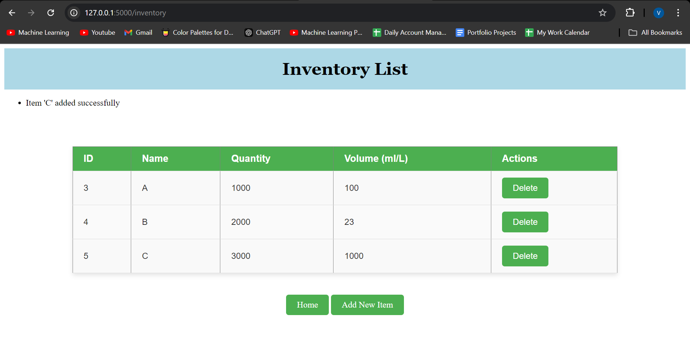

# 📦 Inventory Management Web App 🛠️
## 📄 Overview
Welcome to the Inventory Management Web App repository! 🚀 This project features a basic and minimalistic web application designed to help you manage inventory efficiently. Built using Python for the backend and Flask for the frontend, this app allows you to easily view, add, and delete items from your inventory. Whether you're managing a small stock of products or just experimenting with web development, this app is simple yet effective! 🔧

## 🔑 Key Features
- View Inventory 📋: Displays a list of all items currently in stock, complete with relevant details.
- Add New Item ➕: Easily add new products to the inventory by filling out a quick form.
- Delete Item 🗑️: Remove outdated or unnecessary items with a single click, keeping your inventory up to date.
## 🚀 Getting Started
Follow the steps below to set up and run the app on your local machine:

1. Clone the Repository
2. Install Dependencies
   Ensure you have Python installed, then install the required packages using:
```
pip install -r requirements.txt
```
3. API Key
    Make sure to replace the "your_api_key" in app.py with your own self-generated API key.
4. Run the Application
Launch the app using the Flask development server:
```
python app.py
```
## 🎨 Tech Stack
- Python 🐍: The main programming language used to build the app's backend logic.
- Flask 🔥: A lightweight framework used to create the web interface and handle requests.
- HTML, CSS 🎨: Used to design a clean and responsive interface for interacting with the inventory.
## 📊 Features
- Dashboard: View all the items in your inventory with details like item name, quantity, and status.
- Add Items: A simple form where you can add new items to the inventory.
- Delete Items: Remove items that are no longer needed or have run out.
## 🛠️ How to Use
- View Inventory: Navigate to the dashboard to see your current stock.
- Add New Items: Click on the "Add Item" button, fill in the item details, and submit.
- Delete Items: Use the delete button next to any item to remove it from the inventory.
## 📦 Use Cases
1. Small Business: Perfect for small-scale inventory management in shops or small warehouses.
2. Personal Projects: Ideal for developers looking to learn Flask and web development through a real-world project.
## Project Screenshots 📸

